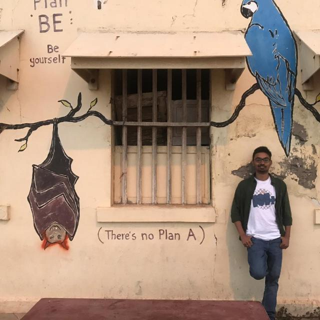

  
  
  <h1 align="center">Hi 👋, I'm Rameez Raza</h1>
  <h3 align="center">Software Development Engineer @ Intel Corporation</h3>
  <h4 align="center">System Software | Performance Optimization | AI Solutions</h4>

  
 
    
  

  
 
     
  

  

    
    
    
  

---

### � About Me

I am a passionate **Software Development Engineer** based in **Bangalore, India**, with a strong background in **Computer Science** and **Information Technology**. Currently working at **Intel**, I specialize in:

- 🏎️ **System Performance:** Optimizing power & thermal management for Intel platforms.
- 🤖 **AI & Automation:** Building predictive models and automating workflows to reduce manual effort.
- 🔧 **System Software:** Developing drivers, installers (WiX), and hardware-software interfaces.
- 🐧 **Cross-Platform:** Expert in Linux and Windows development environments.

---

### 💼 Professional Experience

#### **Intel Corporation** | *Software Development Engineer* (Aug 2020 – Present)
> *Enhancing platform efficiency, thermal management, and automation.*
- **Performance:** Optimized CPU/GPU power balance, improving benchmarks (Cinebench, 3DMark).
- **ChromeOS:** Tuned Intel SoC performance for Google ChromeOS devices.
- **Automation:** Integrated **Intel Dynamic Tuning Technology (DTT)**, reducing manual testing by **80%**.
- **Tools:** Built AI-powered workload prediction tools (75% accuracy) and thermal monitors.

#### **Intel Corporation** | *Software Development Intern* (May 2019 – May 2020)
- **Log Management:** Deployed ELK Stack for advanced analysis.
- **ML Integration:** Built log clustering frameworks and reduced unit testing time by **90%**.

---

### 🛠 Technical Arsenal

| Category | Skills |
|----------|--------|
| **Languages** |     |
| **Tools** |     |
| **Specialties** | System Software, Embedded Systems, AI/ML, WiX Toolset |

---

### 🏆 Achievements

- 🥇 **Intel Awards:** Recognized for consistent high-impact contributions.
- 🚩 **CTF Winner:** Won Intel’s Capture The Flag competition.
- 🎓 **GATE Qualified:** 96th percentile in CS (2018, 2019, 2020).

---

  
<i>Lets build something amazing together!</i>

